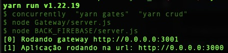

# Projeto_A3
Essa aplicação web tem como objetivo expor endpoints para o acesso do usuário do sistema de clínicas médicas 

# Componentes do Grupo
| Nome completo | RA        |
|---|-----------|
| Aline Sousa Lima | 819214026 | 
| Felipe Batista da Silva | 821244065 |
| Gabriela Nunes Barbosa | 821140737 |
| Guilherme Augusto Mota Barbosa | 821224564 |

# Pre-requisitos para instalação da aplicação.
Seguem os links para instalação dos softwares iniciais. Seguir as configurações relevantes de acordo com o seu sistema operacional que cada fabricante exige. Desconsiderar caso a instalação de algum ou mais deles já tenha sido feita. 
- Instalar o Git. Link [download e instalação](https://git-scm.com/book/en/v2/Getting-Started-Installing-Git)
- Instalar o NodeJS e npm. Link [download e passos para instalação](https://nodejs.org/en/download/).
- Instalar o Yarn. Linbk [download e instalação](https://classic.yarnpkg.com/en/docs/install)
- Instalar o Swiper para o carrossel [documentação](https://swiperjs.com/angular)

# Build da aplicação
A partir da linha de comando ou prompt do seu sistema operacional, defina ou crie um diretório para efetuar o download da aplicação. Exemplo (repos): 
```
mkdir repos
```
Entre no seu diretório que você definiu ou conforme o exemplo digite o comando abaixo para entrar no diretório:
```
cd repos
``` 
Faça o clone do repositório com o comando git
```
git clone https://github.com/Felipeb26/Projeto_A3.git
```

# Execução da aplicação
A partir do diretório que foi efetuado o clone (ou seja, o repos ou o diretório que você definiu) digite os comandos a seguir para efetuar download das dependencias e compilação da aplicação:
```
npm i -g yarn
npm i -g @angular/cli@14
cd Projeto_A3
yarn ou npm install
em cada subpasta do repositorio Projeto_A3 deverá 
ser feito o comando yarn ou npm install para instalar
as dependecias necessarias de cada projeto
```
Em caso de sucesso das execuções descritas a seguinte tela será apresentada


# Endpoints da aplicação
Segue a documentação de contratos que a interface do usuário possa acessar os endpoints definidos para as funcionalidades em questão [Swagger](http://localhost:3001/index)

# Primeiro microserviço Através do Barramento

| endpoint gateway| endpoint | method | info|
|----------|---------|------|------|
| <http://localhost:3001/crud/login>      |<http://localhost:3000/login> | POST | enviar email e senha para receber Bearer token para ter acesso aos demais endpoints. |
| <http://localhost:3001/crud/consultas>      |<http://localhost:3000/consultas> | GET | retorna todos as consultas relacionadas ao medico e paciente cadastrados.|
| <http://localhost:3001/crud/docs>      |<http://localhost:3000/docs> | GET | retorna todos os medicos cadastrados.|
| <http://localhost:3001/crud/users>      |<http://localhost:3000/users> | GET | retorna todos os usuarios cadastrados.|
| <http://localhost:3001/crud/users>      |<http://localhost:3000/users> | POST | Salva usuario sendo necessario nome email tellefone senha e role |
|<http://localhost:3001/crud/users-page> | <http://localhost:3000/users-page> | GET | retorna todos os usuarios paginando.|
| <http://localhost:3001/crud/user/{id}>  |<http://localhost:3000/user/{id}> | GET | recebe como paraetro o id do usuario para localizar.|
| <http://localhost:3001/crud/user/{id}>       |<http://localhost:3000/user/{id}> | PUT | recebe o id para localizar o usuario e o corpo de acordo com os parametros para serem alterados.|
| <http://localhost:3001/crud/user/{id}>       |<http://localhost:3000/user/{id}>  | DELETE | receb o id do usuario afim de excluir ele do banco de dados.|

# Segundo microserviço Através do Barramento!

| endpoint gateway| endpoint | method | info|
|----------|---------|--------|---------|
| <http://localhost:3001/mail/bem-user> | <http://localhost:3003/bem-user> | POST | envia um email um email para o usuario dando  parabens por se cadastrar no programa.|
| <http://localhost:3001/mail/bem-doc> | <http://localhost:3003/bem-doc> | POST | envia um email um email para o medico dando  parabens por se cadastrar no programa.|
| <http://localhost:3001/mail/preview> | <http://localhost:3003/preview> | POST | recebe array de bytes para uso de dowload ou preview do pdf sendo obrigatorio enviar o modelo do arquivo.|
| <http://localhost:3001/mail/medicamento> | <http://localhost:3003/medicamento> | POST | envia um email com o pdf de todos os medicamentos para serem utilizados pelo paciente .|
| <http://localhost:3001/mail/atestado> | <http://localhost:3003/atestado> | POST | envia um email com o pdf de todos o atestado referente ao paciente.|

Para rodar o docker-compose.yml usar comando - "docker-compose up --build"
